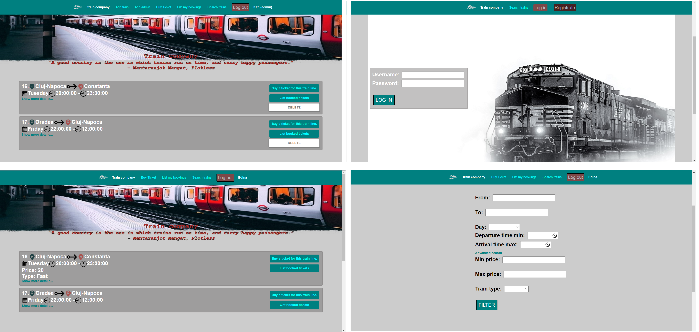

# Train-company-web-page

I build this simple project for my web course. I had asked to create a webpage for users to book tickets.

I also created a docker image and an automated Azure process for testing and deployment (https://train-company.herokuapp.com/ was not deployed with the database) for the Software Engineer topic. You can open these files from the “docker-azure_pipeline” directory.

User roles: admin, user, guess.


# Technologies

Package manager: npm

Backend: NodeJS with Express

Code style: ESlint

Frontend: EJS - embedded JavaScript templates, JavaScript, HTML, CSS

Database: MySQL (host: localhost; port 3306; user: root; password: feim1911; database: web)

# Getting started
- Clone the repository
```
git clone https://github.com/FazakasEdina/Train-company-web-page.git
```
- Install dependencies
```
cd Train-company-web-page
npm install
```
- Build and run the project
```
npm start
```
  Navigate to `http://localhost:8080`


Contact
-------
If you require any further information, feel free to contact me.

Email: fazakasedina20@gmail.com